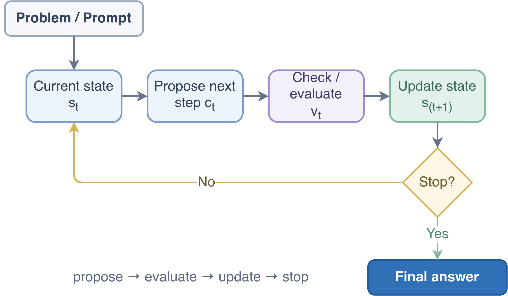
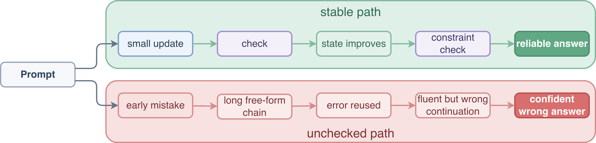
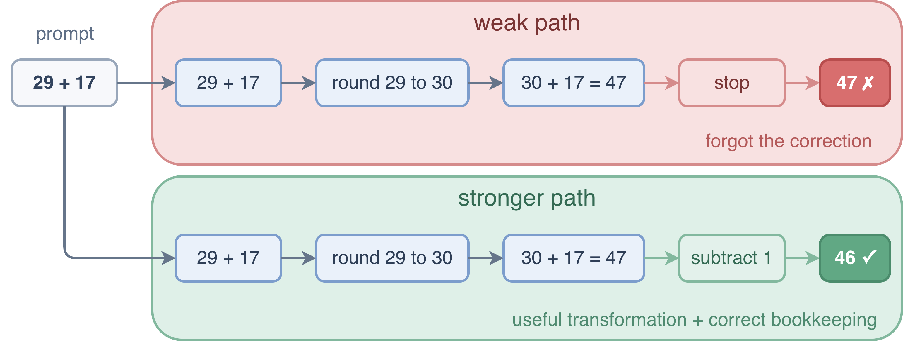
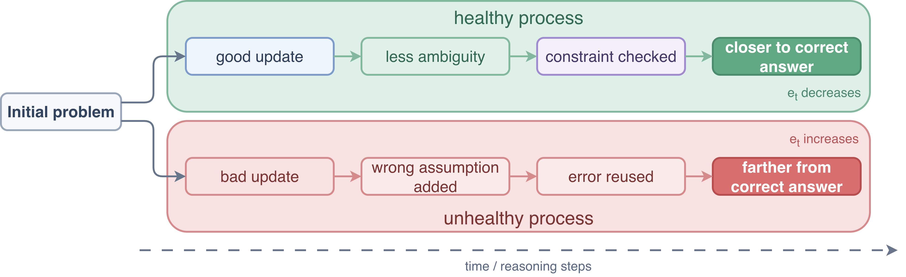

# Reasoning Is Not Longer Text

## 1. Why models go wrong on multi-step tasks

Language models often fail not because they lack facts, but because they mishandle intermediate steps.

That shows up in familiar ways: a plausible math solution forgets one correction, a coding fix patches the symptom instead of the cause, or a planning answer violates a constraint introduced three steps earlier.

In the standard setup, a language model keeps predicting the next token. That works when the path from input to answer is short, but it is brittle on multi-step tasks. Once the model starts going in the wrong direction, later tokens often continue the mistake instead of fixing it.

That is the central problem:

> some tasks are hard not because the final answer is complicated, but because getting there requires a sequence of good intermediate updates

Reasoning models matter because they try to make those updates more reliable.

## 2. Reasoning is state improvement

The core idea is simple:

> a reasoning system improves a problem state over multiple deliberate updates before committing to a final answer
{: .note }

The state could be a scratchpad, a partial derivation, a draft plan, a search tree, a set of candidate answers, a partially written program, or just a running belief about what is likely correct.

So instead of thinking in terms of `prompt -> answer`, it is better to think in terms of `prompt -> partial state -> improved state -> checked state -> answer`.

## 3. The loop behind most reasoning systems

Most reasoning systems follow the same loop:

1. start with the problem and an initial state
2. propose a next step
3. evaluate that step
4. update the state
5. repeat until a stopping condition is met

In short:

- **State:** where the solver currently is
- **Proposer:** what suggests the next move
- **Evaluator:** what judges the move
- **Updater:** what changes the state
- **Stop rule:** what decides the process is done

Sometimes one model plays all of these roles. Sometimes there is a separate verifier, search controller, or external tool. Either way, the loop is a general template.

In minimal notation, let `P` be the proposer, `E` the evaluator, and `U` the updater:

$$
\begin{aligned}
c_t &= P(s_t) \\
v_t &= E(s_t, c_t) \\
s_{t+1} &= U(s_t, c_t, v_t)
\end{aligned}
$$

The process stops when the updated state is good enough (as shown in the diagram below).

This loop already covers chain-of-thought prompting, self-consistency, verifier-guided reasoning, search-based reasoning, tool-using agents, and reinforcement-trained reasoning systems.

Before going further, it helps to keep three layers separate:

- one-pass generation: prompt in, answer out, with little explicit state management
- inference-time reasoning loops: propose, check, update, and stop while solving one problem
- training-time improvements: post-training or reinforcement learning that makes better updates more likely later

Readers often blur these layers together. Keeping them separate makes the rest of the article easier to read.

## 4. What keeps a reasoning process on track

**A good reasoning process is not just long.** It is deliberate, checked, and bounded.

By stabilizer, I mean any mechanism that makes bad updates less likely to survive: a verifier, a tool check, a branch limit, or a stop rule.

Three patterns matter most:

- keep some useful working state, whether visible or latent
- separate proposing from trusting
- limit drift with checks, bounds, or backtracking

That is why good reasoning often looks modest rather than dramatic. It moves in manageable steps, checks those steps, and avoids letting one weak update control the whole trajectory (see the contrast below).

## 5. Why long chains still fail

Long reasoning traces fail for a simple reason: each step depends on the earlier ones.

If one early step is wrong, later steps may keep building on it until the model has constructed a polished story around a bad premise.

> Longer reasoning is not automatically better reasoning.
{: .warning }

The common failure pattern is:

1. make a mistake early
2. explain it smoothly
3. reuse it in later steps
4. become harder to correct because the whole chain now sounds coherent

So the real danger is not only wrong answers. It is bad state getting amplified across steps.

## 6. Three small examples

### 6.1 Working arithmetic example

Take `17 + 18`.

A good solver may split it into tens and ones, combine `10 + 10 = 20` and `7 + 8 = 15`, then reduce the state to `20 + 15`, and finally to `35`.

The point is not that the model wrote several lines. It is that each update made the problem easier while preserving it.

### 6.2 Failure arithmetic example

Now take `29 + 17`.

A weak solver may round `29` up to `30`, compute `47`, and stop. The transformation looked smart, but it changed the problem and forgot the correction step.

A stronger solver uses the same move with the right bookkeeping: round up, compute `47`, subtract `1`, then answer `46` (compare the two paths in the diagram below).

### 6.3 Debugging example

Suppose a bug report says a parser crashes only when a helper returns an empty list.

A weak trajectory might notice the crash, guess the parser needs a null check, patch the parser directly, and stop because the patch looks plausible.

A stronger trajectory proposes a hypothesis about helper output, checks that hypothesis against the surrounding code or tests, updates the state to the narrower failure mode, patches the relevant assumption, and re-runs checks before stopping.

The gain is not verbosity. It is that the solver keeps a more accurate evolving state of the bug.

## 7. A simple way to think about correctness over time

It helps to track one abstract quantity, $$e_t$$, meaning the remaining error or uncertainty in the state at step $$t$$.

This is only a mental tool, not a formal convergence proof. In a healthy process, $$e_t$$ tends to go down over time. In an unhealthy one, it grows as weak assumptions and unchecked branches accumulate.

**The key question is not:**

> did the model produce many reasoning steps?

**It is:**

> did the steps reduce uncertainty, or did they amplify it?
{: .note }

In search, backtracking, or exploration, some local steps may temporarily increase uncertainty. What matters is whether the overall process becomes more reliable, as the diagram below illustrates.

## 8. How current methods fit the picture

Three common methods fit the picture in slightly different ways.

### 8.1 Self-consistency

Sample multiple reasoning paths and aggregate them.

- **State:** the prompt plus several candidate reasoning paths.
- **Updater:** the base model samples multiple trajectories.
- **Stabilizer:** agreement across samples.
- **Main failure mode:** all samples may share the same misconception.

### 8.2 Verifier-guided or search-based reasoning

Expand candidate paths and score which ones survive.

- **State:** a partial proof, partial program, or search node.
- **Updater:** a generator expands the state and a controller decides which branches survive.
- **Stabilizer:** a verifier or scoring function.
- **Main failure mode:** weak scoring, expensive search, or pruning the right path too early.

### 8.3 Reinforcement-trained reasoning

Use training to make better updates more likely over time.

- **State:** the prompt plus a partial reasoning trace, sometimes with tool feedback.
- **Updater:** the policy model produces the next step.
- **Stabilizer:** training rewards, verifier feedback, or filtered selection.
- **Main failure mode:** reward hacking or polished but shallow behavior.

These methods differ, but they share the same pattern: make useful updates more likely and bad updates less likely to survive.

## 9. A practical recipe: propose, check, update, bound

This is the most useful design pattern in the article.

> This works because it separates creativity from trust. Generating and accepting should not be the same operation.
{: .note }

### Propose

Generate one or more possible next steps:

- a subgoal
- a calculation step
- a tool call
- a candidate answer
- a branch in a search tree

### Check

Evaluate whether the step is valid or useful:

- exact computation
- rule checking
- consistency testing
- verifier scoring
- tool confirmation

### Update

Keep the step only if it improves the state:

- append a valid step
- replace a weak candidate
- branch into promising paths
- backtrack after a failed check

### Bound

Limit drift and cost with explicit constraints:

- maximum step count
- search depth
- branch caps
- stop conditions
- periodic resets

## 10. Checklist

- What exactly is the state?
- What changes from one step to the next?
- Who proposes the next step?
- Who checks whether the step is valid or useful?
- What is the stabilizer: voting, verification, search, tools, or constraints?
- What kind of error can accumulate across iterations?
- Can the system recover from a bad early step?
- Does extra test-time compute improve correctness, or only produce longer text?
- Are intermediate steps making the task simpler?
- What is the stopping rule?

## 11. The takeaway

Reasoning models are state-update systems. The useful question is not whether they "thought longer," but whether they improved the state in a controlled way.

> Reasoning is controlled state improvement, not just longer output.
{: .note }
