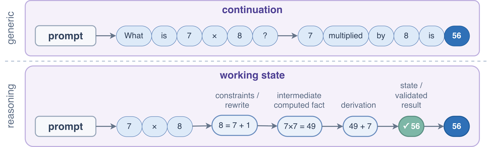
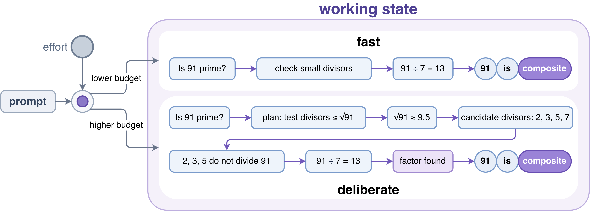
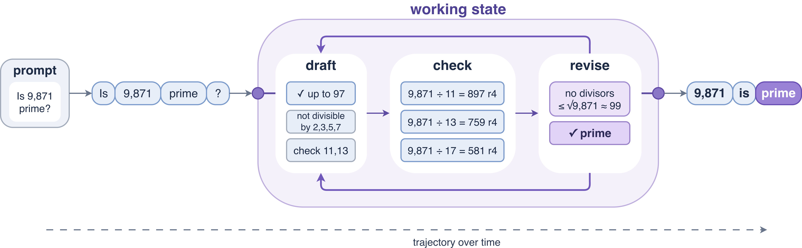

# Three Open Reasoning Models

## 1. The baseline: fluent continuation

Standard LLMs are continuation engines. They read the prompt, extend the text, and often do well when the path from input to answer is short.

That is enough for many familiar tasks. It becomes weaker when the quality of the intermediate steps matters more than the fluency of the final answer.

This is where open reasoning models became a meaningful category. They are still LLMs, but they are shaped to use the trajectory more like a partial computation than like a shallow continuation.

## 2. What changed and what did not

The main change is how the running state is used. In a generic LLM, prior text is mostly continuation history. In a reasoning model, prior text is used more like a partial solution state.

A reasoning model is therefore more likely to treat the trajectory as:

- current hypothesis
- working set of constraints
- partial derivation
- active problem state that still needs improvement

But the basic machine is still familiar:

- **Base model:** still usually a transformer-style autoregressive LLM
- **Tokens:** still generated one step at a time
- **Visible reasoning:** still text in many practical systems

So the shift is mostly behavioral, training-related, and inference-related rather than architectural.

One short line captures the whole difference:

> the trajectory is closer to computation, not just continuation
{: .note }

## 3. Where the gains really come from

If the backbone is often similar, where do the gains come from?

Usually from three levers, in roughly this order:

1. **training or post-training** that shapes better multi-step behavior
2. **better use of inference-time budget**
3. **better constraint handling** and less premature answering

## 4. Three open-model patterns

These three model families are useful because each makes a different version of the same broad shift visible.

### 4.1 QwQ

The cleanest mental model for QwQ is:

> reasoning gains from making one trajectory stronger
{: .note }

What matters is not a brand-new architecture, but reinforcement-shaped post-training that makes one reasoning path more competent before you add a large external search procedure around it.

What it adds beyond a generic LLM is:

- better single-trajectory problem solving
- stronger multi-step behavior without needing a large wrapper system
- a clearer example of reasoning gains coming from post-training rather than from more output alone

**The casual misreading** is to reduce it to "more verbose output." The point is that one trajectory is doing more useful work (see the diagram below for the contrast with plain continuation).

### 4.2 Qwen3

The cleanest mental model for Qwen3 is:

> reasoning as an explicit budgeted mode
{: .note }

What matters is not just that it has two modes, but that the budget and performance tradeoff is made legible to the user. The model family makes it explicit that some tasks want a faster general mode while others justify a more deliberate reasoning mode.

What it adds beyond a generic LLM is:

- a visible separation between fast and deliberate behavior
- a practical way to think about when extra reasoning budget is worth paying for
- a clearer product-level interface to the reasoning question

**The casual misreading** is to think the difference is only "longer answers." The more important point is when to spend more effort at all (as the lower-budget and higher-budget paths below make clear).

### 4.3 DeepSeek-R1

The cleanest mental model for DeepSeek-R1 is:

> reasoning shaped toward reflection and verification
{: .note }

What matters is that reflection and self-checking are presented as part of the learned behavior of the trajectory itself, not only as something wrapped around the model from outside.

What it adds beyond a generic LLM is:

- a stronger example of reasoning style being induced through training
- a trajectory that is framed as more self-corrective
- a useful bridge between "better base behavior" and "verification-aware reasoning"

**The casual misreading** is to flatten it into another generic RL story. The sharper point is that the trajectory is being pushed toward reflection and verification (shown below as a draft-check-revise loop).

## 5. The wrong way to read these models

The weakest interpretation is:

> these are just normal LLMs with longer context or more words
{: .warning }

Longer context helps a model see more. Longer output gives it more room to say things. Neither one automatically makes it better at decomposition, constraint tracking, delayed commitment, or productive use of extra inference-time compute.

**The right question is not** "did the answer get longer?"

> did the trajectory become more useful?
{: .note }

## 6. How to read the next model release

When a new reasoning model appears, ask:

- is the trajectory being used mainly as history, or as a partial solution state?
- do the gains come mostly from training, from extra budget, or from a larger surrounding system?
- is the model making one path stronger, making the budget tradeoff explicit, or shaping the trajectory toward checking itself?
- does extra effort improve the answer, or only make it longer?

> These questions will usually tell you more than benchmark headlines alone.
{: .note }

## 7. Checklist

- Do not confuse longer output with better reasoning.
- Do not confuse a stronger reasoning model with a larger reasoning system around it.
- Ask what changed in behavior, not only in architecture.
- Ask whether one trajectory is better, whether the budget tradeoff is clearer, or whether the model is more verification-shaped.
- Treat QwQ, Qwen3, and DeepSeek-R1 as three different ways of making the same broad category legible.

## 8. The takeaway

Open reasoning models are still LLMs, but they use the trajectory differently.

QwQ highlights stronger single-trajectory reasoning. Qwen3 highlights reasoning as an explicit budgeted mode. DeepSeek-R1 highlights reasoning shaped toward reflection and verification.

> That is why these models feel different. The trajectory is being used less like plain continuation and more like computation.
{: .note }
