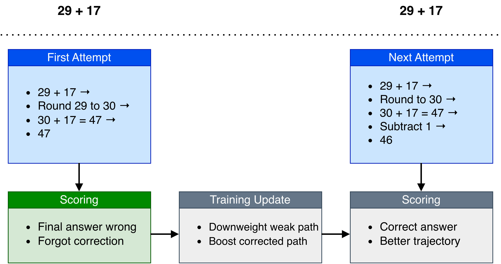
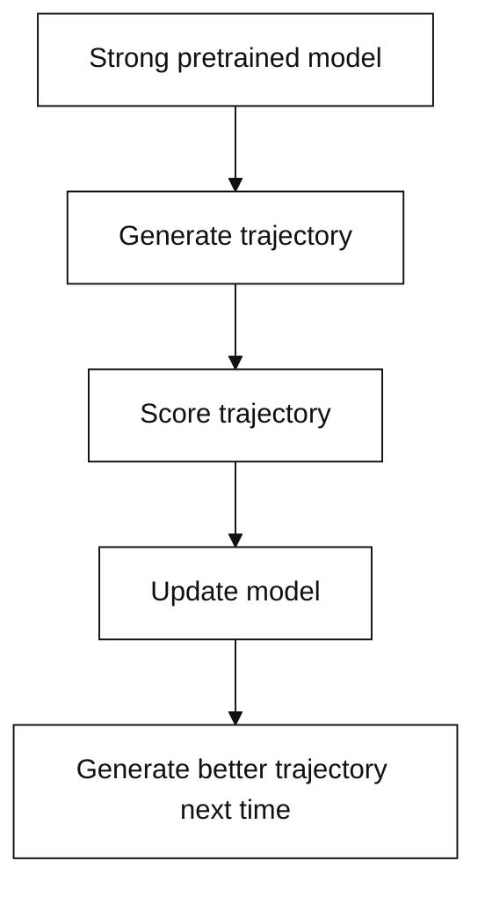
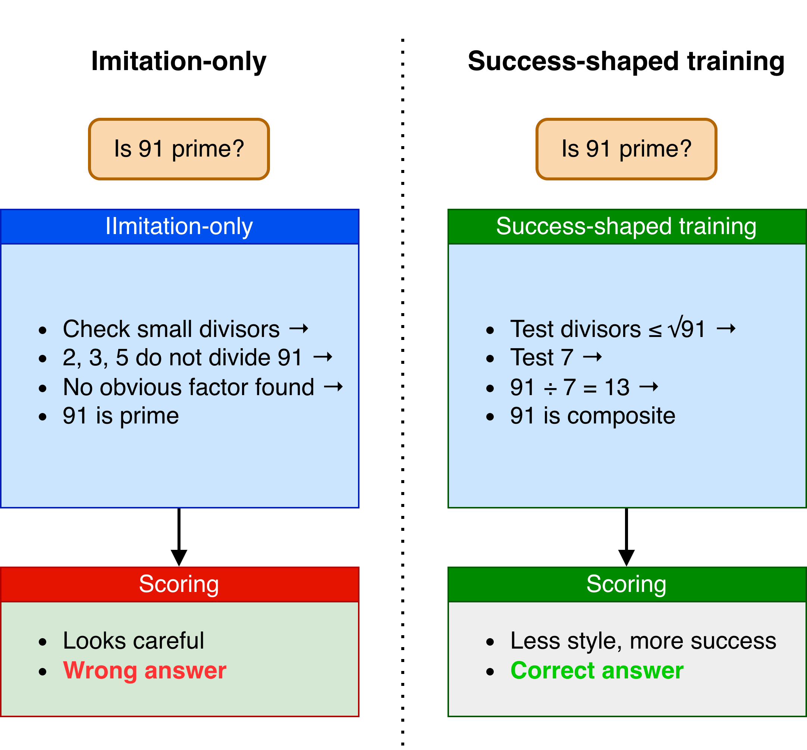
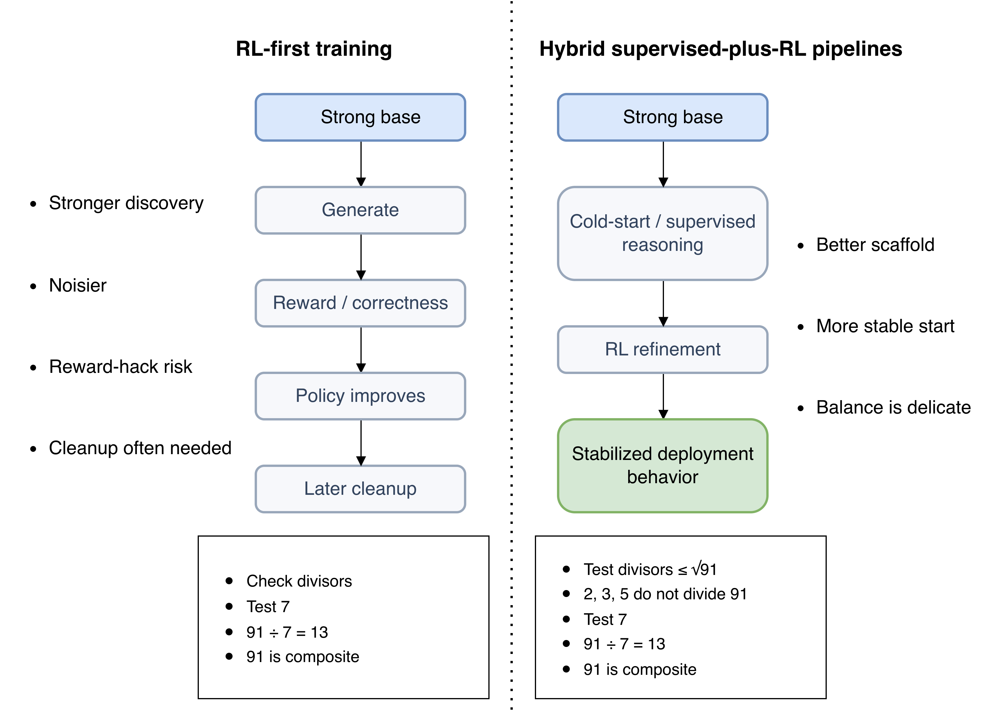
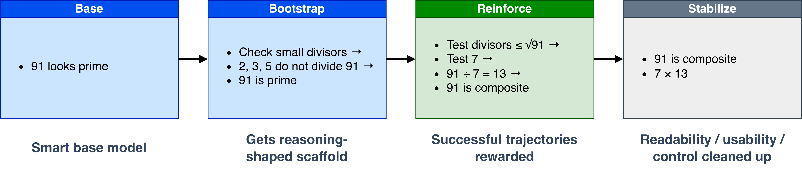

# How Open Reasoning Models Are Trained

## 1. Why baseline training is not enough

The previous post was about what changed in reasoning models at the behavior level. The next question is how that behavior gets trained.

Pretraining and ordinary instruction tuning can produce a smart, helpful model. That is not the same thing as producing a model that stays reliable over a long solution trajectory.

Hard reasoning tasks need the model to delay premature answers, preserve intermediate constraints, recover from local mistakes, and use extra inference-time budget productively. That is why reasoning-model training is not just "make the answer sound step-by-step." It is "make good trajectories more likely."

## 2. What reasoning training is really trying to change

The core shift is that reasoning-model training tries to improve the quality of the trajectory, not just the wording of the final answer.

A generic chat model is pushed mostly toward helpfulness, fluency, instruction following, and plausible answers.

A reasoning model is pushed more strongly toward solving before answering, maintaining a useful intermediate state, and spending effort in ways that actually improve the solution.

That is why the real target is better trajectory control, not just better prose style.

## 3. The loop: generate, score, update

At the abstract level, most reasoning training reduces to the same loop.

1. start from a strong pretrained model
2. generate a trajectory and final answer on tasks where reasoning matters
3. score what happened
4. update the model so better trajectories become more likely

That score can come from final correctness, rule-based rewards, process labels, reinforcement-learning signals, or some mixture of them.

So the shortest useful summary is:

> generate -> score -> update

The important point is that the target may include visible reasoning text, but it is not limited to visible text. What matters is the quality of the underlying decision sequence.

## 4. How that becomes a real pipeline

The abstract loop is not the same thing as the real training pipeline.

The loop says what optimization is trying to do. The pipeline says how you stage that optimization in practice.

A practical pipeline often looks like this:

1. strong pretraining
2. some supervised alignment or cold-start reasoning data
3. reasoning-oriented reinforcement learning
4. optional cleanup, distillation, or usability tuning

The stages are separated because the goals do not fully align. Raw reasoning improvement, readability, controllability, and deployment usability are not always best optimized by the same step.

So the pipeline is staged partly for capability and partly for cleanup.

## 5. Why imitation is not enough

A common mistake is to think reasoning training means "just add lots of chain-of-thought examples."

Worked-out traces do help, but imitation alone does not solve the main problem. A model can imitate the style of reasoning without learning reliable reasoning behavior. It may produce long explanations that only look careful, memorize common traces, or become more verbose without becoming more accurate.

That is why reasoning training usually needs a signal tied to actual success, not only to reasoning format.

## 6. Two ways open reasoning models are trained

### 6.1 RL-first training

The cleanest idea behind RL-first training is that reinforcement learning can directly shape long-horizon solution behavior when the success signal is meaningful.

That is why the method exists at all: it can discover stronger behavior than direct imitation when solving the task is more important than matching a style.

Its strength is obvious. It can push a model toward harder reasoning behavior, especially on tasks where the final answer is verifiable.

Its weakness is just as important. RL-first training can be noisy, can exploit weak rewards, and often needs later cleanup because raw capability and usable behavior are not the same thing. A model may become stronger while also becoming harder to read, less stable, or easier to reward-hack.

### 6.2 Hybrid supervised-plus-RL pipelines

The practical alternative is a hybrid pipeline.

Here the supervised stage is not just "extra data." It acts as scaffolding. It gives the model a usable initial reasoning style and prevents RL from having to discover everything from scratch.

Then RL pushes beyond imitation toward harder reasoning behavior.

That is why hybrid pipelines are so common. Supervision gives the model a stable starting point; RL sharpens the parts that matter most for hard tasks.

The weakness is that the balance is delicate. Too much supervised shaping can make the model rigid. Too much RL without stabilization can hurt readability, controllability, or behavior on easy tasks.

## 7. How recent open models fit the pattern

The named models from the previous post are useful here because they illustrate different ways the training pipeline can be staged and explained.

| Model | Training reading | What it illustrates |
| --- | --- | --- |
| QwQ | strong base model plus RL-shaped reasoning behavior | better single-trajectory reasoning through post-training |
| Qwen3 | hybrid behavior with explicit faster and deeper modes | training for usability, not just raw reasoning depth |
| DeepSeek-R1 | RL-first reasoning with later stabilization stages | both the promise and the messiness of RL-shaped reasoning |

These examples matter because future model releases will usually be some variation on the same pattern: strong base model, some form of bootstrap, some form of reward shaping, and some story about stabilization or usability.

## 8. A simple template: Base -> Bootstrap -> Reinforce -> Stabilize

This is the shortest practical template for reading modern open reasoning-model pipelines.

### Base

Start with a strong pretrained model.

### Bootstrap

Give it enough reasoning-shaped data or cold-start supervision so it has a usable initial trajectory style.

### Reinforce

Use correctness signals or rewards so successful trajectories become more likely.

### Stabilize

Clean up readability, mode control, general usability, or deployment behavior.

That four-step template is not the only way to train these models, but it is a good way to understand what most modern pipelines are trying to do.

## 9. Checklist

- Is the training signal tied to final correctness, process quality, or both?
- Is the model only imitating reasoning traces, or is it rewarded for actual success?
- Where does the bootstrap stage end and the RL stage begin?
- What was needed after RL to make the model usable?
- Is the release describing raw reasoning gains, readable behavior, or both?
- Does the training make good intermediate updates more likely?

## 10. The takeaway

Reasoning-model training is not mainly about making answers look thoughtful. It is about making useful trajectories more likely.

That is why modern pipelines are usually staged. They build a strong base, bootstrap a usable reasoning style, reinforce successful behavior, and then stabilize the result for real use.

The real target is better state updates.
